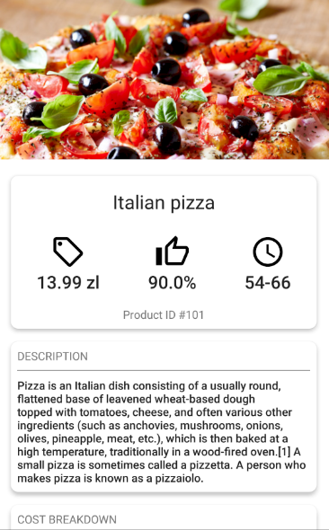

# foody-application
This is my playground project where I integrate new things which I've been learning in order to get better experience. The project constists of backend written on Django and a native android application.
The project itself is food ordery service. I fency Glovo design therefore I use almost the same design, colors.

# Overview
The android application consists of three modes. One mode is for clients where they can order food. Second mode is for cooks where they can accept and handle orders. And the last mode
is for administrative purposes where is implemented adding, removing and editing products.

### 1.1 Authentication & Authorization view
Authentication is done by Token-based protocol.

&nbsp;
&nbsp;

In order to get access to the application user must sign up and then confirm an email. If the user checked "I want to cook", it is also needed to be accepter by the administrator.

&nbsp;
&nbsp;
&nbsp;

When the user is cook or administrator, then there is a view to select a specific role.

&nbsp;
&nbsp;

### 2 Client view
On the client view user can order some food. There is rouned buttons which represents food categories(this is not impemented in the beta version). 

&nbsp;

Once the user selected a specific category or selected "All", the view with the list of available food is opened:

&nbsp;

If the user clicks any item, the detail view will be opened:

&nbsp;
&nbsp;

On the detail screen the user can order one or more food. Alternatively the user can add to the cart.
Desides, on the client view the user has drawer view with additional options:

&nbsp;

The user is able to edit the current personal information:

&nbsp;

Moreover on the client view, there is a bottom swipable view. That view represents a history or pending items:

&nbsp;

If the user clicks history item, he will be redirected to that product detail, however if the user cliecs 'pending' item, the current status view will be opened:

&nbsp;

### 3 Cook view
This view is similar to the client view except there is only one button. Once that button is cliecked, the cook is able to see the list of currently opened orders. The cook can select and hanle one. The most delayed orders are highlited and at the top of the list.

&nbsp;
&nbsp;

Once the cook has accepted some order, the detailed view is opened where the cook can change the current progress:

&nbsp;
&nbsp;

### 4 Administrator view
This view represents a control panel where the administator can do the following:
* Accept cook request
* Add/Edit category
* Add/Edit product

&nbsp;

On the "Request" view the administator accepts the cook requests:

&nbsp;

On the "Category" view the adminstator can add new categories as well as edit.

&nbsp;
&nbsp;

On the "Products" view the administrator can add new products as well as edit olds:

&nbsp;
&nbsp;
&nbsp;

## Change log
* 1.0.0-beta1
  * Authentication & authorization
  * Create Client view
  * Create Cook view
  * Create Administrator view
  * Add history list view
  * Implement adding/removing/editing products/categories
  * Giving feedback
  * Ordering process
  * Editing personal information
  * Implement searching on Administrator and Client views

## What I've learnt?
* 1.0.0-beta1
  * MVVM 
  * Navigation Component
  * LottieFiles Animations
  * Timber
  * Retrofit
  * Kotlin Coroutines
  * Kotlin Flow
  * New Datastore Preferences
  * Paging 3
  * Coil
  * Kotlin Delegates
  * Android testing
  * Rotating screens experience
  * Data Binding
  * Authentication & authorization process
  * Recycler View
